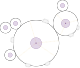
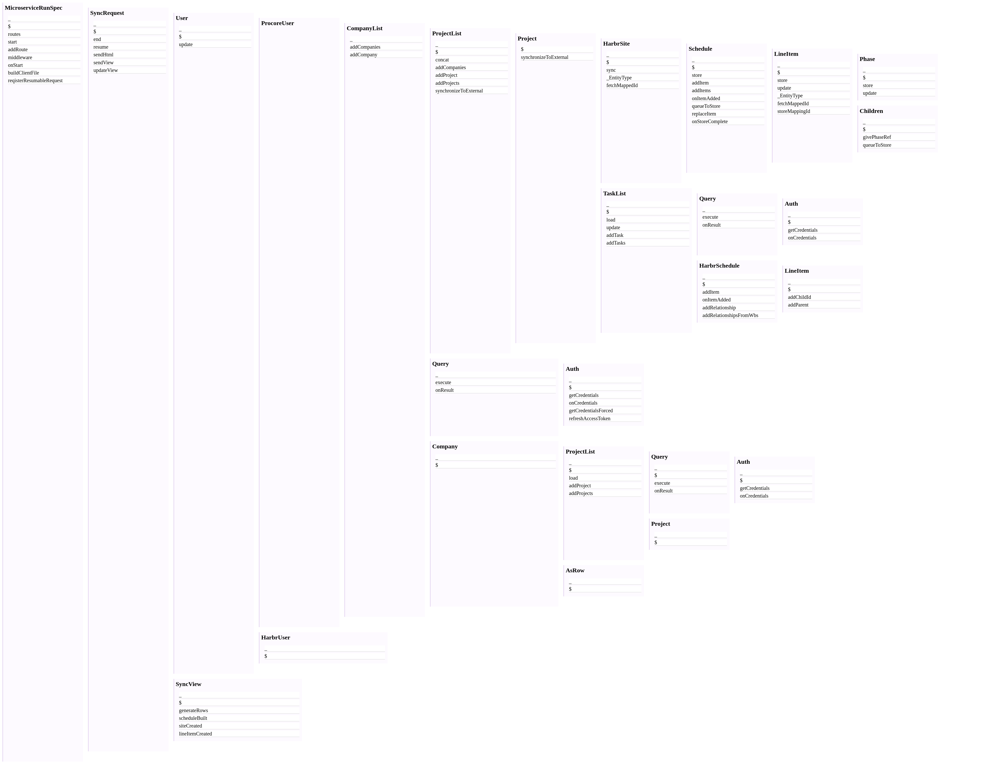
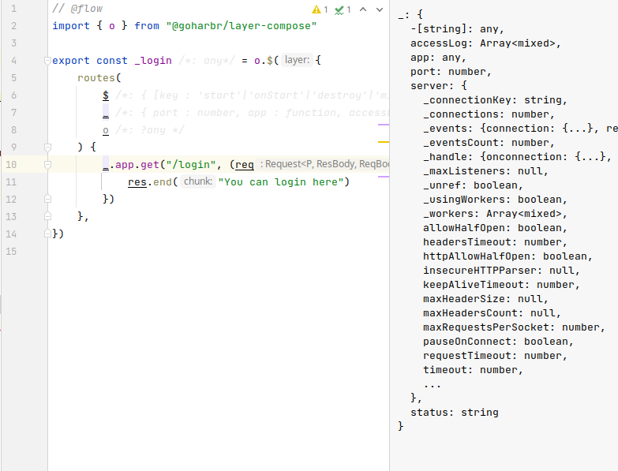
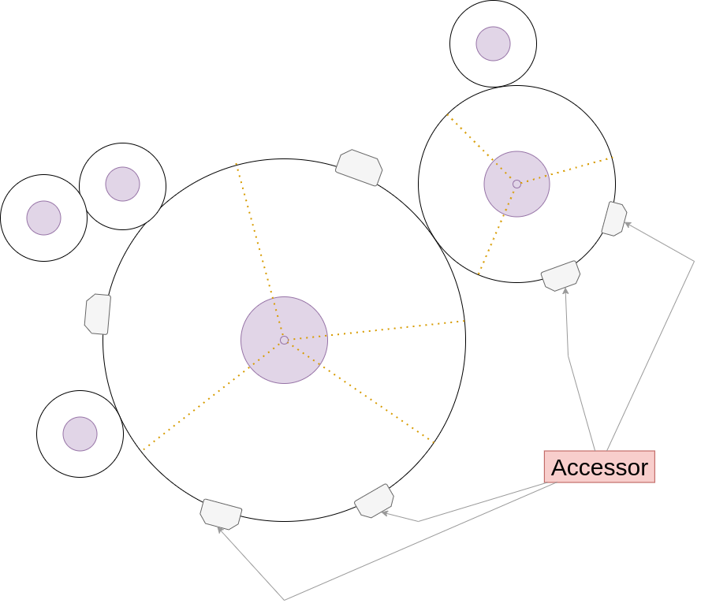

<p align="right">
Photo by <a href="https://unsplash.com/@mufidpwt?utm_source=unsplash&utm_medium=referral&utm_content=creditCopyText">Mufid Majnun</a> on <a href="https://unsplash.com/t/textures-patterns?utm_source=unsplash&utm_medium=referral&utm_content=creditCopyText">Unsplash</a>
</p>

<p align="center" style="font-size:20px">

Architecture Visualized (live)
<br/>
</p>

[//]: # ()
[//]: # (<p align="center" style="font-size:20px">)

[//]: # (<br/>)

[//]: # (Or, look! Dependency injection meets Lenses and Mixins to form the backbone of data flow in your applications. )

[//]: # (</p>)


--------

Lenses meet Reactive OOP for maintainable architectures

---

## `layer-compose` is born: I got tired of writing sh*tty code.


## Goals
- One way to do the same thing twice: creating predictable architecture patterns within and across teams
- Saf**er** mutable state: have the peace of mind as when working with *immutable* state
- **Ease when refactoring** architecture
- Ability to split classes into reusable components (mixins) / **clear separation of concerns**
- Ability to **visualize component relationships**
- **Predictable async**
- Handle work that can be done by a machine, by a machine: eg. automatically generate type definitions, 
create dataflow and class relationship diagrams
- Keep library surface and **learning curve minimal**


## Introduction

LayerCompose aims to improve code quality by removing a major source of bugs in Javascript dealing with state and providing
reusable, repeatable and predictable architectural pattern.

Classes are built up by combining layers (similar to [mixins](https://en.wikipedia.org/wiki/Mixin)) into `Compositions` so that the code can be minimal initially and build up over time.
`Lenses` provide extra functionality through composition, while keeping separation of concerns clear and maintaining context for Dependency Injection.

Predictable async is achieved by treating each instance of a `Composition` as a green thread, guaranteeing order of execution and access to the
mutable inner state (known as `core`). Reactivity is built into `Compositions` embodying an [Actor pattern](https://en.wikipedia.org/wiki/Actor_model).

*layerCompose* shines when implementing [Model-Controller](https://en.wikipedia.org/wiki/Model–view–controller) 
business logic of an application, especially when there are shifting and unpredictable requirements. 
*layerCompose* is in-between a language and a framework: while it is pure JavaScript it does have predefined naming conventions giving it a feel 
of a *sub*set of JavaScript. The end result is full expressiveness of JS for implementing logic within predictable architecture.  

## layerCompose

In a nutshell, *layerCompose* assembles numerous functions in the form:
```javascript
    function fn ($ /* "super", like js `this` */, _ /* "core": like React props (but writable) */, opt /* additional named options */) {}
```
in nested configurations
```javascript
/* Referred to as Composition */
const Apple  = layerCompose(
        // top layer
    {
        generateConfig($,_) { console.log(_.name + " top is generating") },

        /* this is a lens */        
        Remote: [
            {
                send($,_,opt) { /* eg. if (opt.optKey === 1) ... */ }
            },
            {
                receive($,_,opt) {}
            }
        ]
    },
        
    // bottom layer
    {
        generateConfig($,_) { console.log(_.name + " bottom is generating") },
    }    
)
```
into a _Composition_ that can be instantiated
```javascript
    const a = Apple({name: 'honey-crisp'})
    a.generateConfig() 
    // prints:
    // "honey-crisp bottom is generating"
    // "honey-crisp top is generating"
    
    a.Remote(r => r.send({optKey: optVal}))
    a.Remote(r => r.receive())
```

## Features
- Simple and powerful ***Dependency Injection***
- Generated Composition ***relationship diagrams***, visualizing program execution
  
- ***Auto type*** -- automatic typing for functions and interfaces (works well to be useful, will be improved with demand).
  Generates [flow.js](https://flow.org) types without a single manual input.
  

## Deep dive





## Layer

A POJO is built up as layers with each layer able to mutate a section of the POJO’s state, also called the core.  Each layer is mutually exclusive.  


## Lense 

Adds functionality and has access to the core.  Can also be a layer with its own core.

## External Interface

Functions that can be called on the pojo to access or mutate state.

## Example

Lets look at a shopping cart which consists of information related to the cart, items in the cart and the user who owns the cart.

Lets create an item that just has an id and a name

```
const Item = lc() //create the layer
Item._ = _id // add an id to the core.  The underscore is the accessor for the core
Item._ = _name // add a name property
``` 

Lets create a cart where we can add some items

```
const Cart = lc()
```

## Related work

###Trait libraries
- [Straits](https://straits.github.io/introduction/) (not in active development): Babel-compiled traits syntax for javascript, 
allowing to mix in new functions into existing objects. Main focus seems to be creating pipelines (eg: map, reduce, filter)

- [Traits.js](https://github.com/traitsjs/traits.js) (not in active development): Readme overviews traits, comparing traits and mixins.
Has concepts of required trait methods and conflicting methods.

### Reactive libraries

- [rxjs](https://rxjs.dev/guide/overview): popular JS reactive programming library. [Fluh](https://github.com/StreetStrider/fluh) provides a 
friendlier introduction into reactive JS. 
- [Fluh](https://github.com/StreetStrider/fluh): constructing reactive dependency graphs. Simplified FRP

### State libraries
- [Raj](https://jew.ski/what-is-raj/) (complete solution in 34 lines of code): Simpler and scalable redux
- [Immer](https://github.com/immerjs/immer): State management through immutability 

### Papers
- [Scalable Component Abstractions](http://lampwww.epfl.ch/~odersky/papers/ScalableComponent.pdf): Components in Scala


## License
Modified GNU AGPLv3.

-----

### Contributors:
- Anton Kats
- Hamish Anderson

### Sponsors:<br/>
<a href="https://harbr.com"></a>

