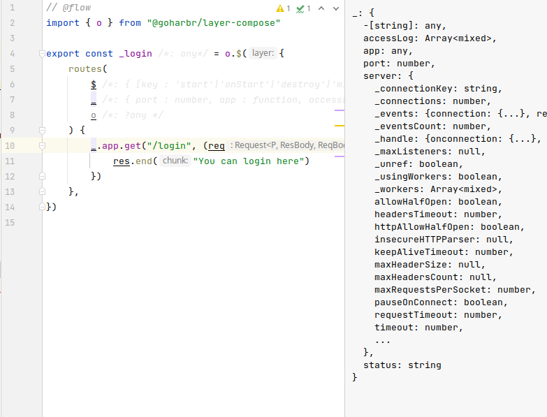

<p align="right">
Photo by <a href="https://unsplash.com/@mufidpwt?utm_source=unsplash&utm_medium=referral&utm_content=creditCopyText">Mufid Majnun</a> on <a href="https://unsplash.com/t/textures-patterns?utm_source=unsplash&utm_medium=referral&utm_content=creditCopyText">Unsplash</a>
</p>

<p align="center" style="font-size:20px">
<br/>
Lenses meet Reactive OOP
</p>

[//]: # ()
[//]: # (<p align="center" style="font-size:20px">)

[//]: # (<br/>)

[//]: # (Or, look! Dependency injection meets Lenses and Mixins to form the backbone of data flow in your applications. )

[//]: # (</p>)


--------

I made layer-compose because I got tired of writing sh*tty code.
--------

*layerCompose* shines as a business logic layer of your application, providing safety for implementing
 state management and data flow, allowing your team to focus on the logic. It provides flexibility in
adding functionality as the application grows, easing the pain of having to figure out the 
entire architecture up-front.
  
*layerCompose* can be thought of as a language: a subset of JavaScript (opposite of a superset!): it **constrains** you (making it easier to work as a team) and 
counterintuitively gives you more **power** by letting you focus on the implementation and worry less about the architectural choices.  

## layerCompose

In a nutshell, *layerCompose* assembles numerous functions in the form:
```javascript
    function fn ($ /* "super", like js `this` */, _ /* "core": like React props (but writable) */, opt /* additional named options */) {}
```
in nested configurations
```javascript
/* Referred to as Composition */
const Apple  = layerCompose(
        // top layer
    {
        generateConfig($,_) { console.log(_.name + " top is generating") },

        /* this is a lens */        
        Remote: [
            {
                send($,_,opt) { /* eg. if (opt.optKey === 1) ... */ }
            },
            {
                receive($,_,opt) {}
            }
        ]
    },
        
    // bottom layer
    {
        generateConfig($,_) { console.log(_.name + " bottom is generating") },
    }    
)
```
into a _Composition_ that can be instantiated
```javascript
    const a = Apple({name: 'honey-crisp'})
    a.generateConfig() 
    // prints:
    // "honey-crisp bottom is generating"
    // "honey-crisp top is generating"
    
    a.Remote(r => r.send({optKey: optVal}))
    a.Remote(r => r.receive())
```

### Why?

1. Mutable state management is notoriously prone to bugs.  
2. Async is difficult.
3. Writing code with multiple authors is notoriously prone to inconsistencies.  

## Features

***Auto type*** -- automatic typing for functions and interfaces (works well to be useful, will be improved with demand).
Generates [flow.js](https://flow.org) types without a single manual input.


## Learn

Start with the `tutorial` folder
