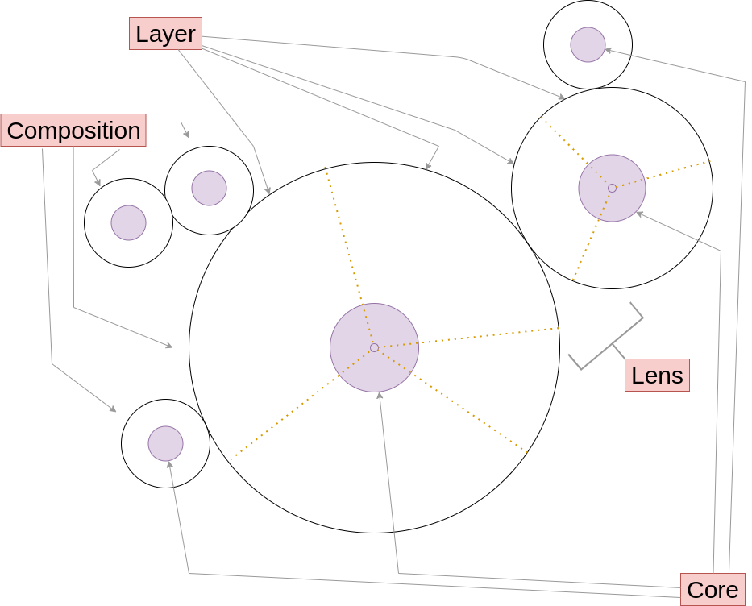

<p align="right">
Photo by <a href="https://unsplash.com/@mufidpwt?utm_source=unsplash&utm_medium=referral&utm_content=creditCopyText">Mufid Majnun</a> on <a href="https://unsplash.com/t/textures-patterns?utm_source=unsplash&utm_medium=referral&utm_content=creditCopyText">Unsplash</a>
</p>

<p align="center" style="font-size:20px">

Architecture Visualized (live)
<br/>
</p>

[//]: # ()
[//]: # (<p align="center" style="font-size:20px">)

[//]: # (<br/>)

[//]: # (Or, look! Dependency injection meets Lenses and Mixins to form the backbone of data flow in your applications. )

[//]: # (</p>)


--------

Lenses meet Reactive OOP for maintainable architectures

---

## `layer-compose` is born: I got tired of writing sh*tty code.


## Goals
- One way to do the same thing twice: creating predictable architecture patterns within and across teams
- Saf**er** mutable state: have the peace of mind as when working with *immutable* state
- **Ease when refactoring** architecture
- Ability to split classes into reusable components (mixins) / **clear separation of concerns**
- Ability to **visualize component relationships**
- **Predictable async**
- Handle work that can be done by a machine, by a machine: eg. automatically generate type definitions, 
create dataflow and class relationship diagrams
- Keep library surface and **learning curve minimal**


## Introduction

LayerCompose aims to improve code quality by removing a major source of bugs in Javascript dealing with state and providing
reusable, repeatable and predictable architectural pattern.

Classes are built up by combining layers (similar to [mixins](https://en.wikipedia.org/wiki/Mixin)) into `Compositions` so that the code can be minimal initially and build up over time.
`Lenses` provide extra functionality through composition, while keeping separation of concerns clear and maintaining context for Dependency Injection.

Predictable async is achieved by treating each instance of a `Composition` as a green thread, guaranteeing order of execution and access to the
mutable inner state (known as `core`). Reactivity is built into `Compositions` embodying an [Actor pattern](https://en.wikipedia.org/wiki/Actor_model).

*layerCompose* shines when implementing [Model-Controller](https://en.wikipedia.org/wiki/Model–view–controller) 
business logic of an application, especially when there are shifting and unpredictable requirements. 
*layerCompose* is in-between a language and a framework: while it is pure JavaScript it does have predefined naming conventions giving it a feel 
of a *sub*set of JavaScript. 

The end result is full expressiveness of JS for implementing logic and control flows within a Composition, 
with [declarative](https://en.wikipedia.org/wiki/Declarative_programming) style when outlining the execution of the entire application.  

## The Differentiator

If you're looking to understand what makes `layer-compose` different from other _mixin/traits_ libraries or other _actor_ libraries:

> _Layers_ are **additive**. There is no traditional overriding of methods with the same name.
> While traits and mixins have resolution mechanism when there are naming conflicts, _Layers_ execute **all** the provided code. 

## Showcase



In a nutshell, *layerCompose* assembles numerous functions in the form:
```javascript
    function fn (
        $ /* "super" akin to `this` */, 
        _ /* "core": mutable state */, 
        o /* named arguments */) {}
```
in nested configurations
```javascript
/* Referred to as Composition */
const Apple = lc()

/* a `layer` */
Apple._sweetness /* _type is a `layer` name tag for improved visualization */ = {
    /* constructor function */
    $($,_) {
        defaults(_, {sweetnessLevel: 0.1})
    },
  
    grow($,_,o) {
        if (o.sunshineLevel > 0.5) {
            _.sweetnessLevel += 0.3        
        }
    }
}

/* another `layer` */
Apple._offspring = {
    $($,_) {
        defaults(_, {canHaveOffspring: false}) // `core` cannot contain `undefined` values,
    },
  
    // notice that the `layer` above has a function with the same name
    // both will be executed when calling `apple.grow()` (read more about execution order in the "Deep Dive" section)
    grow($,_,o) {
      _.maximumSeedCount = o.sunshineLevel * _.sweetnessLevel * 20
    },
  
    /* 
    `accessor` -- the only way to expose `core` values to the outside 
    note the notation: must start with `_` followed by a capital letter
     */
    _MaximumSeedCount: (_) => _.maximumSeedCount,
    
    /* Defining a `Lens` */
    Seeds: {
        _($,_,o) {
            _.thresholdModifier = o.isColdWinter ? 0.5 : 1 // if the winter is cold, less seeds will sprout 
        },
        $($,_) {
            defaults(_, {seeds: []})
            $.setSeedCount()
            $.generateSeeds()
        },
      
        setSeedCount($,_,o) {
            if (o.seedCount) {
                _.seedCount = Math.round(o.seedCount * _.thresholdModifier)
            } else {
              // dependency injection: looking up the context chain (parental chain) to find the first Apple type Composition
              // `return` forces the `Seeds` Composition to suspend until the dependency injection is complete

              return Apple($, parentApple => {
                _.seedCount = Math.round(parentApple._MaximumSeedCount * _.thresholdModifier)
              })    
            }
        },
      
        * generateSeeds($,_) {
            for (let i = 0; i < _.seedCount; i++) {
              // suspending `Seeds` composition instance until all the seeds are instantiated  
              yield $.Seed({birthOrder: i}, seed => {
                  _.seeds.push(seed)
              })   
            }
        },
      
        sprout($,_) {
            // suspends `Seeds` composition until all seeds sprout
            return _.seeds.map(s => s.sprout())  
        },
        
        /* Defining another `Lens` */
      
        Seed: {
            $($, _) {
              setTimeout($.sprout, _.birthOrder * 1000)
            },
            sprout($,_) { /* ... */ }
        }
    }
}

```

into a _Composition_ that can be instantiated using a [declarative](https://en.wikipedia.org/wiki/Declarative_programming) approach

```javascript
    Apple({sweetnessLevel: 0.2 /* override the default */}, 
        apple => { // callback after the constructor completes
            apple.grow({sunshineLevel: 0.8})
          
            apple.Seeds({}, seeds => { // callback runs after the Lens constructor completes
                seeds.sprout() // calls upon each `Seed` to `sprout()`
            })
    })
```

## Features
- ***Borrow checks***: ensuring that only a single layer has write access to specific key-value pair 
- Simple and powerful ***Dependency Injection*** 
- ***Execution thread per composition*** ensuring sequential execution even for async functions
- ***Actor model***
- Generated composition ***relationship diagrams***, visualizing program execution  
  
- ***Auto type*** -- automatic typing for functions and interfaces (works well to be useful, will be improved with demand).
  Generates [flow.js](https://flow.org) types without a single manual input.  
  

## Deep dive

### Composition
A *composition* is very similar to a traditional class. 
The difference is that a *composition* is defined by combining (and recombining) **layers**.
Just like classes, compositions are defined and can then be instantiated.

```javascript
const C = lc()
C._layer = {/* ... */}

// Creating an instance
// first argument is data (POJO) to wrap around (it is inserted into the `core`)
// which becomes available thorugh the `_` argument in methods
// second argument is a callback when the instance of `C` is ready
C({}, instance => {/* do someting with `instance` */})
```

#### Interface and core
The diagram in the [showcase](#showcase) section illustrates the `interface` wrapping over the `core`, 
which is not accessible to the outside. The only way to mutate the `core` is by calling methods available on the `interface` 
(an instance of a _composition_)

#### Composition instances are functions

Here `instance` will have all the methods as defined across all the layers in combination.
As well, note, `instance` is a function. Calling `instance({...data})` will trigger [transformers](#transformers).

```javascript
C({}, instance => { instance({key: 'value'}) /* updates the core by triggering the transformers */ })
```

### Layer
A _layer_ is a Plain Old JS object containing method definitions. The order of _layers_ is significant, because it 
dictates the [execution order](#execution-order).

Unlike traditional mixins or traits, layers do not allow for any (traditional) overriding. If a function with the same
name is defined in multiple layers, all are executed.

```javascript
const C = lc()
C._bottomLayer = {
    doTask($,_) {
        console.log('doTask bottom layer')
        $.sayMood()
    },
    sayMood($,_) {
        console.log(`Let's be ${_.mood}`)
    }
}
C._topLayer = {
    doTask($,_) {
        console.log('doTask top layer')
    },
}

C({mood: 'celebratory'}, instance => instance.doTask())
// prints:
// doTask bottom layer
// Let's be celebratory
// doTask top layer
```

There are 2 special function names that are reserved: `_` and `$`
- `$` is a [constructor](#constructors)
- `_` is a [transformer](#transformers)

#### Borrow checking

This is a fundamental feature of `layer-compose`: only a single layer has a write access to a specific key on the `core`.

```javascript
const C = lc()
C._bottomLayer = {
    doTask($,_) {
        _.key = 'value'
    },
}
C._topLayer = {
    doTask($,_) {
      _.key = 'adjusted'
    },
}

C({}, instance => instance.doTask())
// throws!
// "`key` has already been set by _bottomLayer!"
```

### Methods
All layer methods follow the signature `fnName($,_,o)`.   
`$` is `self`, which refers to the instance of the `composition`.  
`_` is the `core`, which is the mutable inner state of the `composition`. It is not exposed to the outside. 

### Constructors

Constructors are called once to create an instance of a _composition_. 
Note that constructors do not receive the 3rd (`o`) argument.

```javascript
const C = lc()
C._bottomLayer = {
    $($,_) {
        console.log('bottom')
    },
}
C._topLayer = {
    $($,_) {
        console.log('top')
    },
}

C({}, instance => {} /* callback executed once `$` constructors complete */)
// prints
// bottom
// top
```

### Transformers

Functions named `_` are transformers and are used to update the `core`.  
Transformers are executed when:
1. Instance is constructed
2. Explicit updates are made through `instance({...update})` <br>
   Note that within methods `$({...update})` has the same effect

The `o` parameter is populated with the update object

```javascript
const C = lc()
C._bottomLayer = {
    _($,_,o) {
        if (o.key) {
            _.key = o.key
            console.log('key:' + o.key)
        }
    },
}
C._topLayer = {
    _($,_,o) {
      if (o.anotherKey) {
        _.anotherKey = o.anotherKey
        console.log('anotherKey:' + o.anotherKey)
      }
    },
}

C({key: 'value'}, instance => {
    // printed:
    // key:value
  
    instance({anotherKey: 2})
    // prints:
    // anotherKey:2
})
```

#### Passing core updates for other layers to handle

Given that `layer-compose` is very specific about which _layer_ is allowed to update a key/value on the _core_, 
often updates within a composition happen through `$({...update})` calls.

Modifying the [borrow checking](#borrow-checking) example to make it work:

```javascript
const C = lc()
C._bottomLayer = {
    // adding a Trasnformer to capture core updates
    _($,_,o) {
        if (o.key) _.key = o.key
    },
    
    doTask($,_) {
        _.key = 'value'
    },
}
C._topLayer = {
    doTask($,_) {
      // using the core update mechanism to trigger a mutation in the core through Transformers 
      $({key:'adjusted'})
    },
}

C({}, async instance => {
    await instance.doTask()
    
    // at this point core will contain
    // {key: 'adjusted'}
    // in other words _.key === 'adjusted' returns `true` within layer methods
})
```

#### Expedited execution
Transformer operations are pushed to the front of the queue, and are executed before any other operations. 
See more in [execution order](#execution-order)

### Accessor


### Lens

(todo)

### Execution order


#### Depth first execution


#### Async

#### With generators
Less commonly used approach, useful when processing lists. (todo)

### Dependency Injection

### Utilities

#### `defaults`
#### `parent`
#### `core`
#### `.mock`

## Related work

###Trait libraries
- [Straits](https://straits.github.io/introduction/) (not in active development): Babel-compiled traits syntax for javascript, 
allowing to mix in new functions into existing objects. Main focus seems to be creating pipelines (eg: map, reduce, filter)

- [Traits.js](https://github.com/traitsjs/traits.js) (not in active development): Readme overviews traits, comparing traits and mixins.
Has concepts of required trait methods and conflicting methods.

### Reactive libraries

- [rxjs](https://rxjs.dev/guide/overview): popular JS reactive programming library. [Fluh](https://github.com/StreetStrider/fluh) provides a 
friendlier introduction into reactive JS. 
- [Fluh](https://github.com/StreetStrider/fluh): constructing reactive dependency graphs. Simplified FRP

### State libraries
- [Raj](https://jew.ski/what-is-raj/) (complete solution in 34 lines of code): Simpler and scalable redux
- [Immer](https://github.com/immerjs/immer): State management through immutability 

### Papers
- [Scalable Component Abstractions](http://lampwww.epfl.ch/~odersky/papers/ScalableComponent.pdf): Components in Scala


## License
Modified GNU AGPLv3.

-----

### Contributors:
- Anton Kats
- Hamish Anderson

### Sponsors:<br/>
<a href="https://harbr.com"></a>

